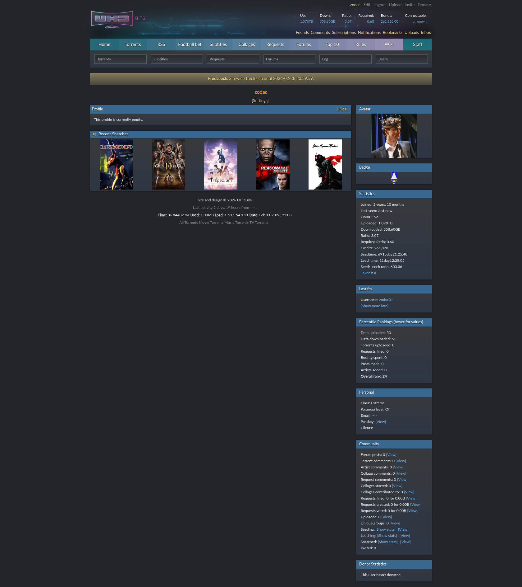

# Tracker Profiles

- [Overview](#overview)
- [Features](#features)
    - [Screenshots](#screenshots)
- [Trackers](#trackers)
    - [Headless](#headless)
    - [Non-Headless](#non-headless)
- [How To Use](#how-to-use)
    - [Tracker Definitions](#tracker-definitions)
    - [Running In Docker](#running-in-docker)
    - [Browser UI](#browser-ui)
        - [UI In Debian](#ui-in-debian)
        - [UI In Windows](#ui-in-windows)
        - [Disable UI](#disable-ui)
    - [Configuration Options](#configuration-options)
- [Contributing](#contributing)
    - [Requirements](#requirements)
    - [Install Git Hooks](#install-git-hooks)
    - [Debugging Application](#debugging-application)
    - [Building And Developing In Docker](#building-and-developing-in-docker)
    - [Implementing Support For New Trackers](#implementing-support-for-new-trackers)
    - [Cloudflare Trackers](#cloudflare-trackers)

## Overview

This is a tool used to log in to private torrent websites and take a screenshot of the user's profile page. This can be used to showcase stats on your
current tracker as part of an application to another site. It can also be used as a historical record of your stats on a tracker in case it goes down
or becomes otherwise unavailable.

## Features

- Opens the selected trackers and logs in, navigating to the user's profile page
- Requests user input for trackers with manual inputs (like Captcha, 2FA, etc.)
- Redacts the user's sensitive information (either replacing the text, or drawing a box over the text):
    - Email address
    - IP address
    - Passkey
- Takes a full-page screenshot of the redacted user profile

### Screenshots

Below are examples of the different types of redaction.

<details>
<summary>Example Screenshots</summary>
<table>
<tr>
<td>

#### Overlay


</td>
<td>

#### Text



</td>
</tr>
</table>
</details>

## Trackers

There are currently **<u>65</u>** supported trackers listed below. The available trackers come in the following types:

- Headless: Can run with the browser in headless mode, meaning no UI browser is needed
- Manual: There is some user interaction needed (a Captcha or 2FA to log in, etc.), requiring a UI browser
- Cloudflare-Check: The tracker has a Cloudflare verification check this will need a UI browser to bypass (overrides **Manual**)

**Note:** Any tracker not listed in any section below has not been tested (most likely due to lack of an account).

### Headless

The following trackers do not require a UI (unless `FORCE_UI_BROWSER` has been set to **true**), and can be run in the background:

| Tracker Name                                      |
|---------------------------------------------------|
| [ABTorrents](https://usefultrash.net/)            |
| [Aither](https://aither.cc/)                      |
| [AlphaRatio](https://alpharatio.cc/)              |
| [AnimeBytes](https://animebytes.tv/)              |
| [Anthelion](https://anthelion.me/)                |
| [BackUps](https://back-ups.me/)                   |
| [BakaBT](https://bakabt.me/)                      |
| [Blutopia](https://blutopia.cc/)                  |
| [BwTorrents](https://bwtorrents.tv/)              |
| [Cathode-Ray.Tube](https://www.cathode-ray.tube/) |
| [DarkPeers](https://darkpeers.org/)               |
| [DICMusic](https://dicmusic.com/)                 |
| [Empornium](https://www.empornium.sx/)            |
| [F1Carreras](https://f1carreras.xyz/)             |
| [FearNoPeer](https://fearnopeer.com/)             |
| [FileList](https://filelist.io/)                  |
| [FunFile](https://www.funfile.org/)               |
| [HDUnited](https://hd-united.vn/)                 |
| [ImmortalSeed](https://immortalseed.me/)          |
| [IPTorrents](https://iptorrents.com/)             |
| [ItaTorrents](https://itatorrents.xyz/)           |
| [Kufirc](https://kufirc.com/)                     |
| [Lat-Team](https://lat-team.com/)                 |
| [Libble](https://libble.me/)                      |
| [Metal-Tracker](https://en.metal-tracker.com/)    |
| [MoreThanTV](https://www.morethantv.me/)          |
| [MyAnonaMouse](https://www.myanonamouse.net/)     |
| [Nebulance](https://nebulance.io/)                |
| [OnlyEncodes](https://onlyencodes.cc/)            |
| [Orpheus](https://orpheus.network/)               |
| [PixelCove](https://www.pixelcove.me/)            |
| [PolishTorrent](https://polishtorrent.top/)       |
| [PornBay](https://pornbay.org/)                   |
| [Redacted](https://redacted.sh/)                  |
| [ReelFlix](https://reelflix.cc/)                  |
| [RUTracker](https://rutracker.org/)               |
| [SecretCinema](https://secret-cinema.pw/)         |
| [SeedPool](https://seedpool.org/)                 |
| [SportsCult](https://sportscult.org/)             |
| [Tasmanites](https://tasmanit.es/)                |
| [TeamOS](https://teamos.xyz/)                     |
| [TorrentLeech](https://www.torrentleech.org/)     |
| [TVChaosUK](https://tvchaosuk.com/)               |
| [UHDBits](https://uhdbits.org/)                   |
| [Unwalled](https://unwalled.cc/)                  |

### Non-Headless

If the following trackers are enabled (either uncommented in `TRACKER_INPUT_FILE_PATH`, or their type is included in `TRACKER_EXECUTION_ORDER`), then
a UI must be enabled. Instructions for this in Docker can be seen [below](#browser-ui).

| Tracker Name                                  | Type                 |
|-----------------------------------------------|----------------------|
| [AnimeTorrents](https://animetorrents.me/)    | **Cloudflare-check** |
| [AvistaZ](https://avistaz.to/)                | **Cloudflare-check** |
| [BeyondHD](https://beyond-hd.me/)             | **Manual**           |
| [BroadcasThe.Net](https://broadcasthe.net/)   | **Cloudflare-check** |
| [CinemaZ](https://cinemaz.to/)                | **Cloudflare-check** |
| [CGPeers](https://cgpeers.to/)                | **Cloudflare-check** |
| [DigitalCore.Club](https://digitalcore.club/) | **Manual**           |
| [DocsPedia](https://docspedia.world/)         | **Manual**           |
| [ExoticaZ](https://exoticaz.to/)              | **Cloudflare-check** |
| [GazelleGames](https://gazellegames.net/)     | **Manual**           |
| [Hawke-Uno](https://hawke.uno/)               | **Cloudflare-check** |
| [HDBits](https://hdbits.org/)                 | **Cloudflare-check** |
| [LST](https://lst.gg/)                        | **Manual**           |
| [PassThePopcorn](https://passthepopcorn.me/)  | **Manual**           |
| [PrivateHD](https://privatehd.to/)            | **Cloudflare-check** |
| [SceneTime](https://www.scenetime.com/)       | **Cloudflare-check** |
| [Speed.CD](https://speed.cd/)                 | **Cloudflare-check** |
| [TheEmpire](https://theempire.click/)         | **Manual**           |
| [TheGeeks](https://thegeeks.click/)           | **Manual**           |
| [UploadCX](https://upload.cx/)                | **Cloudflare-check** |

## How To Use

### Tracker Definitions

First, copy the [trackers_example.csv](./docker/trackers_example.csv) file. This file needs to be updated with your user's login information for each
tracker. Any unwanted trackers can be deleted, or prefixed by the `CSV_COMMENT_SYMBOL` environment variable so they are excluded.

The file can be saved anywhere, and it will be referenced by the `TRACKER_INPUT_FILE_PATH` environment variable when running the application, so
remember where it is saved and what it is named.

### Running In Docker

The application is run using Docker, and below are the commands to run the `latest` docker image.

<details>
<summary>Docker Commands</summary>
<table>

<tr>
<td>

#### Debian

```bash
docker run \
    --env DISPLAY="${DISPLAY}" \
    --env BROWSER_HEIGHT=1050 \
    --env BROWSER_WIDTH=1680 \
    --env CSV_COMMENT_SYMBOL='#' \
    --env ENABLE_ADULT_TRACKERS=true \
    --env ENABLE_TRANSLATION_TO_ENGLISH=true \
    --env FORCE_UI_BROWSER=false \
    --env INPUT_TIMEOUT_ENABLED=false \
    --env INPUT_TIMEOUT_SECONDS=300 \
    --env LOG_LEVEL=INFO \
    --env OUTPUT_DIRECTORY_NAME_FORMAT=yyyy-MM-dd \
    --env OUTPUT_DIRECTORY_PARENT_PATH=/app/screenshots \
    --env REDACTION_TYPE=TEXT \
    --env SCREENSHOT_EXISTS_ACTION=CREATE_ANOTHER \
    --env TAKE_SCREENSHOT_ON_ERROR=false \
    --env TIMEZONE=UTC \
    --env TRACKER_EXECUTION_ORDER=headless,manual,cloudflare-check \
    --env TRACKER_INPUT_FILE_PATH=/app/screenshots/trackers.csv \
    -v /tmp/.X11-unix:/tmp/.X11-unix \
    -v /tmp/screenshots:/app/screenshots \
    --name tracker-profiles \
    --rm zodac/tracker-profiles:latest
```

</td>
<td>

#### Windows

```bash
MSYS_NO_PATHCONV=1 docker run \
    --env DISPLAY=host.docker.internal:0 \
    --env BROWSER_HEIGHT=1050 \
    --env BROWSER_WIDTH=1680 \
    --env CSV_COMMENT_SYMBOL='#' \
    --env ENABLE_ADULT_TRACKERS=true \
    --env ENABLE_TRANSLATION_TO_ENGLISH=true \
    --env FORCE_UI_BROWSER=false \
    --env INPUT_TIMEOUT_ENABLED=false \
    --env INPUT_TIMEOUT_SECONDS=300 \
    --env LOG_LEVEL=INFO \
    --env OUTPUT_DIRECTORY_NAME_FORMAT=yyyy-MM-dd \
    --env OUTPUT_DIRECTORY_PARENT_PATH=/app/screenshots \
    --env REDACTION_TYPE=TEXT \
    --env SCREENSHOT_EXISTS_ACTION=CREATE_ANOTHER \
    --env TAKE_SCREENSHOT_ON_ERROR=false \
    --env TIMEZONE=UTC \
    --env TRACKER_EXECUTION_ORDER=headless,manual,cloudflare-check \
    --env TRACKER_INPUT_FILE_PATH=/app/screenshots/trackers.csv \
    -v /c/tmp/screenshots:/app/screenshots \
    --name tracker-profiles \
    --rm zodac/tracker-profiles:latest
```

</td>
</tr>
</table>
</details>

### Browser UI

There are two ways to execute the application - with a UI browser and without. The default commands will
execute [trackers that require a UI](#non-headless), so the UI will need to be configured to
run through Docker. A UI browser is needed for trackers that:

- Require some user input during login, like a Captcha or 2FA (if `TRACKER_EXECUTION_ORDER` includes **manual**)
- Have a Cloudflare verification check (if `TRACKER_EXECUTION_ORDER` includes **cloudflare-check**)

Below will define how to do this for your host system.

#### UI in Debian

To run through Docker with a UI, local connections to the host display must be enabled:

```bash
# This seems to be reset upon reboot and may need to be reapplied
xhost +local:
```

#### UI in Windows

I use [VcXsrv](https://vcxsrv.com/) as the X server for UI. When configuring VcXsrv, make sure to set the following in the configuration:

- Multiple windows
- Display number 0
- Disable access control

#### Disable UI

To disable the UI and run the browser in headless mode only, ensure `FORCE_UI_BROWSER` and `ENABLE_TRANSLATION_TO_ENGLISH` are set to **false**, and
exclude **manual** and **cloudflare-check** from `TRACKER_EXECUTION_ORDER`. You can also remove `--env DISPLAY` and/or
`-v /tmp/.X11-unix:/tmp/.X11-unix` from the `docker run` command.

### Configuration Options

The following are all possible configuration options, defined as environment variables for the docker image:

| Environment Variable            | Description                                                                                                                                                                                              | Default Value                    |
|---------------------------------|----------------------------------------------------------------------------------------------------------------------------------------------------------------------------------------------------------|----------------------------------|
| *BROWSER_HEIGHT*                | The height (in pixels) of the web browser used to take screenshots                                                                                                                                       | 1050                             |
| *BROWSER_WIDTH*                 | The width (in pixels) of the web browser used to take screenshots                                                                                                                                        | 1680                             |
| *CSV_COMMENT_SYMBOL*            | If this character is the first in a CSV row, the CSV row is considered a comment and not processed                                                                                                       | #                                |
| *ENABLE_ADULT_TRACKERS*         | Whether to take screenshots of trackers that primarily host adult content                                                                                                                                | true                             |
| *ENABLE_TRANSLATION_TO_ENGLISH* | Whether to translate non-English trackers to English                                                                                                                                                     | true                             |
| *FORCE_UI_BROWSER*              | Forces a browser with UI for each tracker (even for headless trackers)                                                                                                                                   | false                            |
| *INPUT_TIMEOUT_ENABLED*         | Whether to add a timeout for when a user-input is required, otherwise waits                                                                                                                              | false                            |
| *INPUT_TIMEOUT_SECONDS*         | If *INPUT_TIMEOUT_ENABLED* is enabled, how long to wait for a user-input (in seconds)                                                                                                                    | 300                              |
| *LOG_LEVEL*                     | The logging level for console output [TRACE, DEBUG, INFO, WARN, ERROR]                                                                                                                                   | INFO                             |
| *OUTPUT_DIRECTORY_NAME_FORMAT*  | The name of the output directory to be created for the of the screenshots (see [Patterns for Formatting and Parsing](https://docs.oracle.com/javase/8/docs/api/java/time/format/DateTimeFormatter.html)) | yyyy-MM-dd                       |
| *OUTPUT_DIRECTORY_PARENT_PATH*  | The output location of the new directory created for the screenshots, relative to the project root                                                                                                       | /tmp/screenshots                 |
| *REDACTION_TYPE*                | Whether to redact by replacing the text, or overlaying a solid box over the sensitive information [OVERLAY, TEXT]                                                                                        | TEXT                             |
| *SCREENSHOT_EXISTS_ACTION*      | What to do when a screenshot for the tracker for the given date already exists [CREATE_ANOTHER, OVERWRITE, SKIP]                                                                                         | CREATE_ANOTHER                   |
| *TAKE_SCREENSHOT_ON_ERROR*      | Whether to take a screenshot of the current tracker page if any failure occurs (in a subdirectory called `errors`)                                                                                       | false                            |
| *TIMEZONE*                      | The local timezone, used to retrieve the current date to name the output directory                                                                                                                       | UTC                              |
| *TRACKER_EXECUTION_ORDER*       | The order in which different tracker types should be executed, at least one must be selected (case-insensitive)                                                                                          | headless,manual,cloudflare-check |
| *TRACKER_INPUT_FILE_PATH*       | The path to the input tracker definition CSV file (inside the docker container)                                                                                                                          | /tmp/screenshots/trackers.csv    |

## Contributing

### Requirements

- [Apache Maven (v3.9.11)](https://maven.apache.org/download.cgi)
- [Docker](https://docs.docker.com/engine/install/) (if using the Docker dev image)
- [Google Chrome](https://www.google.com/chrome/) (only if not using Docker)
- [Java (JDK 25)](https://jdk.java.net/25/)
- [Python (3.13+)](https://www.python.org/downloads/release/python-313/) (only if testing trackers with Cloudflare verification, and not using Docker)

### Install Git Hooks

Run the following command to run git hooks for the project:

```bash
bash ./ci/hooks/setup-hooks.sh
```

### Debugging Application

If `TRACKER_EXECUTION_ORDER` contains **cloudflare-check**, then Python must be configured for your environment. From the root directory, execute the
following:

```bash
source venv/bin/activate
pip install -r ./python/requirements.txt
./venv/bin/python ./python/selenium_manager.py
```

Using IntelliJ, and click on **Run**> **Edit Configurations** and add the environment variables for the application. Once done, open
the [ApplicationLauncher.java](./tracker-profiles-screenshots/src/main/java/net/zodac/tracker/ApplicationLauncher.java) and run the `main`
method from the IDE.
The [AbstractTrackerHandler.java](./tracker-profiles-screenshots/src/main/java/net/zodac/tracker/handler/AbstractTrackerHandler.java) implementation
for each tracker is retrieved by the *trackerName* field within the CSV file.

[Selenium WebDriver](https://www.selenium.dev/documentation/webdriver/) is used to leverage the Chromium web browser to take screenshots. While the
application usually runs in headless mode, this can be changed by updating the `FORCE_UI_BROWSER` value in
the [configuration](#configuration-options). This will cause a new browser instance to launch when taking a screenshot, and can be used for debugging
a new implementation.

### Building And Developing In Docker

Below is the command to build and run the development docker image with everything enabled (requires the UI to be defined):

```bash
docker build -f ./docker/Dockerfile -t tracker-profiles-dev . &&
docker run \
    --env DISPLAY="${DISPLAY}" \
    --env BROWSER_HEIGHT=1050 \
    --env BROWSER_WIDTH=1680 \
    --env CSV_COMMENT_SYMBOL='#' \
    --env ENABLE_ADULT_TRACKERS=true \
    --env ENABLE_TRANSLATION_TO_ENGLISH=true \
    --env FORCE_UI_BROWSER=true \
    --env INPUT_TIMEOUT_ENABLED=true \
    --env INPUT_TIMEOUT_SECONDS=300 \
    --env LOG_LEVEL=TRACE \
    --env OUTPUT_DIRECTORY_NAME_FORMAT=yyyy-MM-dd \
    --env OUTPUT_DIRECTORY_PARENT_PATH=/app/screenshots \
    --env REDACTION_TYPE=TEXT \
    --env SCREENSHOT_EXISTS_ACTION=CREATE_ANOTHER \
    --env TAKE_SCREENSHOT_ON_ERROR=true \
    --env TIMEZONE=UTC \
    --env TRACKER_EXECUTION_ORDER=headless,manual,cloudflare-check \
    --env TRACKER_INPUT_FILE_PATH=/app/screenshots/trackers.csv \
    -v /tmp/.X11-unix:/tmp/.X11-unix \
    -v /tmp/screenshots:/app/screenshots \
    --name tracker-profiles-dev \
    --rm tracker-profiles-dev
```

### Implementing Support For New Trackers

All supported private trackers have an implementation found in the [handler](./tracker-profiles-screenshots/src/main/java/net/zodac/tracker/handler)
package. To add a new one,
extend [AbstractTrackerHandler.java](./tracker-profiles-screenshots/src/main/java/net/zodac/tracker/handler/AbstractTrackerHandler.java), following
the convention from an existing implementation
like [AbTorrentsHandler.java](./tracker-profiles-screenshots/src/main/java/net/zodac/tracker/handler/AbTorrentsHandler.java).

Ensure the [TrackerType](./tracker-profiles-screenshots/src/main/java/net/zodac/tracker/framework/TrackerType.java) is set correctly for your tracker.

### Cloudflare Trackers

The `Cloudflare-check` trackers listed in [Trackers> Non-Headless](#non-headless) are implemented differently from the other trackers, since this
verification check cannot be passed using stock Selenium. [undetected-chromedriver](https://github.com/ultrafunkamsterdam/undetected-chromedriver) is
used to create a web browser that is capable of bypassing Cloudflare detection.

Unfortunately, this is a Python-only package. While a *reasonable* person would migrate the project to Python, I'd prefer to keep writing this in
Java. So a [Python web-server](./python/selenium_manager/server.py) is spun up that exposes endpoints to open/close a Selenium web browser that
can bypass detection. There is a Java implementation of the
[Selenium WebDriver class](./tracker-profiles-screenshots/src/main/java/net/zodac/tracker/framework/driver/python/AttachedRemoteWebDriver.java) which
can attach to the Selenium browser that was launched by Python.

This is all handled by the framework, so an implementation of a tracker can be done following like
[any other tracker](#implementing-support-for-new-trackers), without needing to worry about whether the browser is launched by Java or Python.
