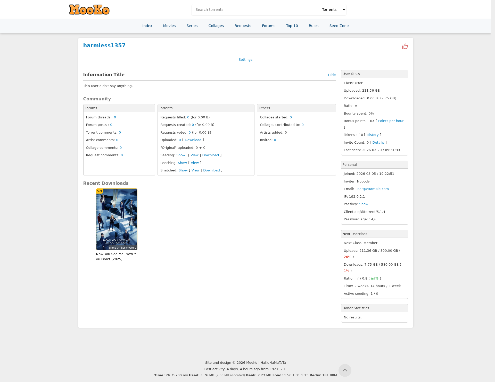
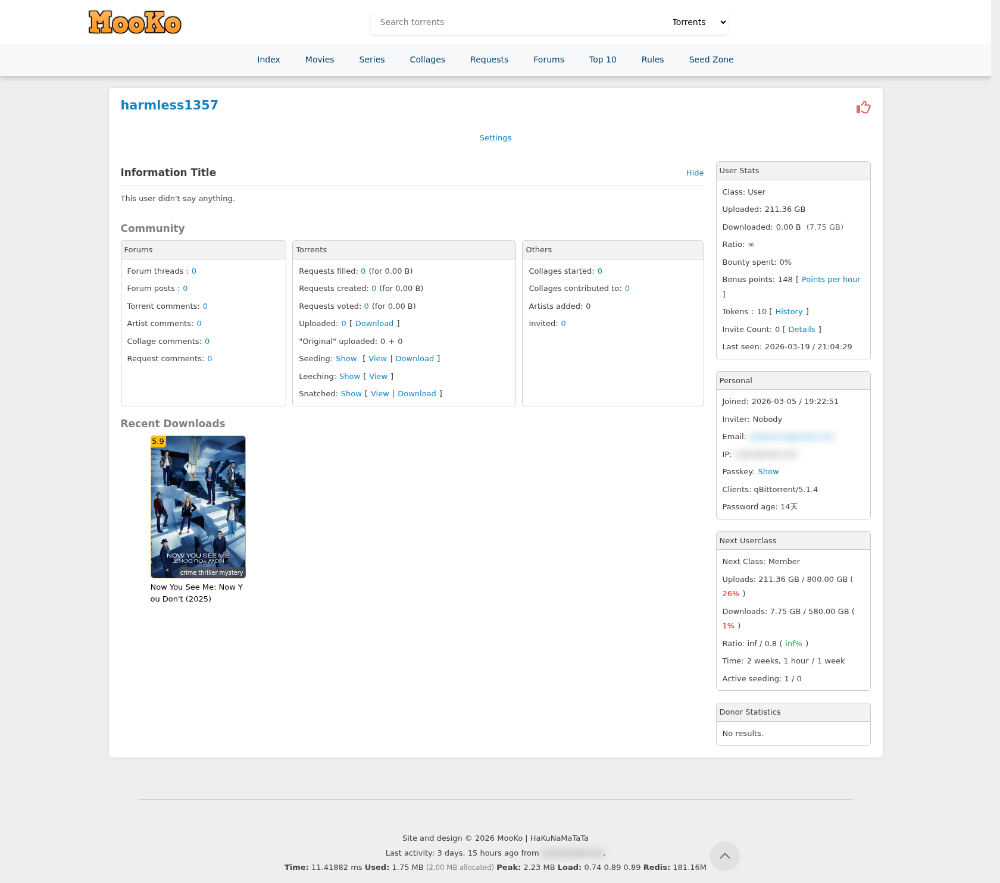
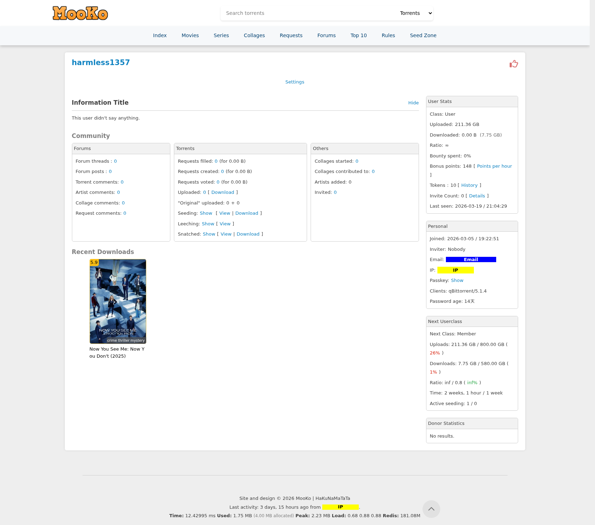
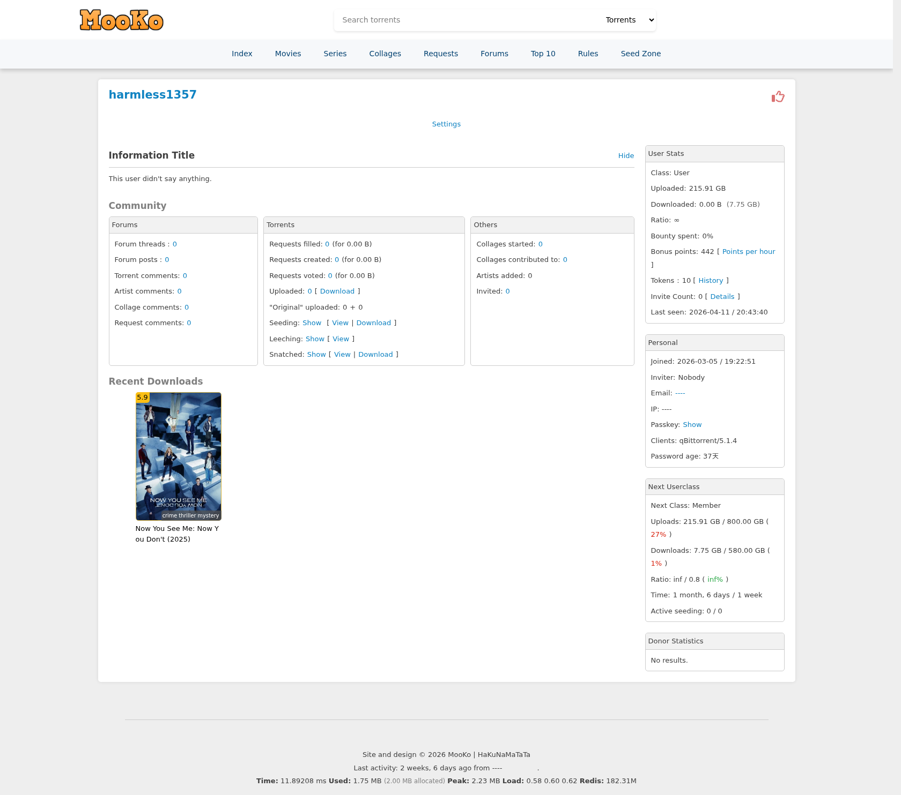

# Tracker Profiles

- [Overview](#overview)
- [Features](#features)
    - [Screenshots](#screenshots)
- [Trackers](#trackers)
    - [Headless](#headless)
    - [Manual Interaction](#manual-interaction)
- [How To Use](#how-to-use)
    - [Tracker Definitions](#tracker-definitions)
    - [Running In Docker](#running-in-docker)
    - [Browser UI](#browser-ui)
        - [UI In Debian](#ui-in-debian)
        - [UI In Windows](#ui-in-windows)
        - [Disable UI](#disable-ui)
    - [Configuration Options](#configuration-options)
- [Versioning](#versioning)
- [AI Usage](#ai-usage)
    - [AI Agents](#ai-agents)
    - [Established Patterns](#established-patterns)
    - [Human Review](#human-review)
    - [Exceptions](#exceptions)
- [Contributing](#contributing)
    - [Requirements](#requirements)
    - [Install Git Hooks](#install-git-hooks)
    - [Debugging Application](#debugging-application)
    - [Building And Developing In Docker](#building-and-developing-in-docker)
    - [Implementing Support For New Trackers](#implementing-support-for-new-trackers)
    - [Cloudflare Verification](#cloudflare-verification)

## Overview

This is a tool used to log in to private torrent websites and take a screenshot of the user's profile page. This can be
used to showcase stats on your current tracker as part of an application to another site. It can also be used as a
historical record of your stats on a tracker in case it goes down or becomes otherwise unavailable.

## Features

- Opens the selected trackers and logs in, navigating to the user's profile page
- Requests user input for trackers with manual inputs (like Captcha, 2FA, etc.)
- Redacts the user's sensitive information
    - There are several types of redaction:
        - Blur (adds a Gaussian blur)
        - Box (draws a solid box)
        - Text (Replaces the text)
        - None (no redaction)
    - There following elements are currently redacted
        - Email address
        - IP address (including ISP)
        - Passkey (for torrents or for IRC)
- Takes a full-page screenshot of the redacted user profile

### Screenshots

Below are examples of the different types of redaction from the [MooKo](https://mooko.org/) tracker.

<details>
<summary>Example Screenshots</summary>
<table>
<tr>
<td valign="top">

#### None



</td>
<td valign="top">

#### Blur



</td>
<td valign="top">

#### Box



</td>
<td valign="top">

#### Text



</td>
</tr>
</table>
</details>

## Trackers

There are currently **141** supported trackers listed below. The available trackers come in the following types:

- Headless: Can run with the browser in headless mode, meaning no UI browser is needed
- Manual: There is some user interaction needed (a Captcha or 2FA to log in, etc.), requiring a UI browser

The implementation for these trackers can be found in
the [handler](./tracker-profiles-screenshots/src/main/java/net/zodac/tracker/handler) package.

### Headless

The following trackers do not require a UI (unless `FORCE_UI_BROWSER` has been set to **true**), and can be run in the
background:

<table>
<tr>
<td valign="top">

| Tracker Name (A–E)                                |
|---------------------------------------------------|
| [ABTorrents](https://usefultrash.net/)            |
| [AcrossTheTasman](https://acrossthetasman.com/)   |
| [Aidoru!Online](https://aidoru-online.me/)        |
| [Aither](https://aither.cc/)                      |
| [Alexandria](https://alxdria.org/)                |
| [AlphaRatio](https://alpharatio.cc/)              |
| [AnimeBytes](https://animebytes.tv/)              |
| [Anthelion](https://anthelion.me/)                |
| [ArabicSource](https://arabicsource.net/)         |
| [ArabP2P](https://www.arabp2p.net/)               |
| [AsianCinema](https://eiga.moi/)                  |
| [AsianDVDClub](https://asiandvdclub.org/)         |
| [Aura4K](https://aura4k.net/)                     |
| [AussieRul.es](https://aussierul.es/)             |
| [BackUps](https://back-ups.me/)                   |
| [BakaBT](https://bakabt.me/)                      |
| [bitGAMER](https://bitgamer.ch/)                  |
| [BitPorn](https://bitporn.eu/)                    |
| [BlueTorrents](https://bluetorrents.com/)         |
| [Blutopia](https://blutopia.cc/)                  |
| [BootyTape](https://ssl.bootytape.com/)           |
| [BrokenStones](https://brokenstones.is/)          |
| [BwTorrents](https://bwtorrents.tv/)              |
| [C411](https://c411.org/)                         |
| [CanalStreet](https://canal-street.org/)          |
| [CapybaraBR](https://capybarabr.com/)             |
| [Cathode-Ray.Tube](https://www.cathode-ray.tube/) |
| [Concertos](https://concertos.live/)              |
| [D3Si.NET](https://d3si.net/)                     |
| [DarkPeers](https://darkpeers.org/)               |
| [DesiTorrents](https://desitorrents.tv/)          |
| [DICMusic](https://dicmusic.com/)                 |
| [DimeADozen](http://www.dimeadozen.org/)          |
| [Empornium](https://www.empornium.sx/)            |
| [ExtremeBits](https://extremebits.net/)           |

</td>
<td valign="top">

| Tracker Name (F–J)                              |
|-------------------------------------------------|
| [F1Carreras](https://f1carreras.xyz/)           |
| [F1GP](https://f1gp.site/)                      |
| [Fappaizuri](https://fappaizuri.me/)            |
| [FearNoPeer](https://fearnopeer.com/)           |
| [FileList](https://filelist.io/)                |
| [FunFile](https://www.funfile.org/)             |
| [GreatPosterWall](https://greatposterwall.com/) |
| [HappyFappy](https://www.happyfappy.net/)       |
| [HDUnited](https://hd-united.vn/)               |
| [Hellenic-HD](https://hellenic-hd.cc/)          |
| [ImmortalSeed](https://immortalseed.me/)        |
| [InfinityHD](https://infinityhd.net/)           |
| [InfinityLibrary](https://infinitylibrary.net/) |
| [IPTorrents](https://iptorrents.com/)           |
| [ItaTorrents](https://itatorrents.xyz/)         |
| [JPopsuki](https://jpopsuki.eu/)                |

</td>
<td valign="top">

| Tracker Name (K–O)                             |
|------------------------------------------------|
| [Kufirc](https://kufirc.com/)                  |
| [Lat-Team](https://lat-team.com/)              |
| [LDU](https://theldu.to/)                      |
| [Libble](https://libble.me/)                   |
| [Luminarr](https://luminarr.me/)               |
| [MalayaBits](https://malayabits.cc/)           |
| [Metal-Tracker](https://en.metal-tracker.com/) |
| [Milkie](https://milkie.cc/)                   |
| [MooKo](https://mooko.org/)                    |
| [MoreThanTV](https://www.morethantv.me/)       |
| [MyAnonaMouse](https://www.myanonamouse.net/)  |
| [Nebulance](https://nebulance.io/)             |
| [NordicBytes](https://nordicbytes.org/)        |
| [NordicHD](http://nordichd.org/)               |
| [NordicQuality](https://nordicq.org/)          |
| [OldToons.World](https://oldtoons.world/)      |
| [OnlyEncodes](https://onlyencodes.cc/)         |
| [Orpheus](https://orpheus.network/)            |

</td>
<td valign="top">

| Tracker Name (P–T)                                   |
|------------------------------------------------------|
| [P2PBG](https://www.p2pbg.com/)                      |
| [PixelCove](https://www.pixelcove.me/)               |
| [PixelHD](https://pixelhd.me/)                       |
| [Podzemlje](https://podzemlje.net/)                  |
| [PolishTorrent](https://polishtorrent.top/)          |
| [Rastastugan](https://rastastugan.org/)              |
| [Redacted](https://redacted.sh/)                     |
| [ReelFlix](https://reelflix.cc/)                     |
| [RetroMoviesClub](https://retro-movies.club/)        |
| [RocketHD](https://rocket-hd.cc/)                    |
| [RUTracker](https://rutracker.org/forum/tracker.php) |
| [SceneHD](https://scenehd.org/)                      |
| [SecretCinema](https://secret-cinema.pw/)            |
| [SeedPool](https://seedpool.org/)                    |
| [SexTorrent](https://sextorrent.myds.me/)            |
| [SlobitMedia](https://media.slo-bitcloud.eu/)        |
| [SportsCult](https://sportscult.org/)                |
| [T3nnis](https://t3nnis.tv/)                         |
| [Tasmanit.es](https://tasmanit.es/)                  |
| [TeamOS](https://teamos.xyz/)                        |
| [TheMixingBowl](https://themixingbowl.org/)          |
| [Torr9](https://torr9.net/)                          |
| [TorrentLeech](https://www.torrentleech.org/)        |
| [TranceTraffic](https://www.trancetraffic.com/)      |
| [TVChaosUK](https://tvchaosuk.com/)                  |

</td>
<td valign="top">

| Tracker Name (U–Z)                              |
|-------------------------------------------------|
| [Unwalled](https://unwalled.cc/)                |
| [VietMediaF](https://tracker.vietmediaf.store/) |
| [XSpeeds](https://www.xspeeds.eu/)              |
| [XWT-Classics](https://xwt-classics.net/)       |
| [YUSCENE](https://yu-scene.net/)                |
| [Zappateers](https://zappateers.com/)           |

</td>
</tr>
</table>

### Manual Interaction

If the following trackers are enabled (either uncommented in `TRACKER_INPUT_FILE_PATH`, or **MANUAL** is included in
`TRACKER_EXECUTION_ORDER`), then a UI must be enabled. Instructions for this in Docker can be seen [below](#browser-ui).

<table>
<tr>
<td valign="top">

| Tracker Name                                        | Reason                                          |
|-----------------------------------------------------|-------------------------------------------------|
| [52PT](https://52pt.site/)                          | Captcha                                         |
| [AnimeZ](https://animez.to/)                        | Captcha                                         |
| [AvistaZ](https://avistaz.to/)                      | Captcha & Cloudflare verificaiton               |
| [BeyondHD](https://beyond-hd.me/)                   | Captcha                                         |
| [BroadcasThe.Net](https://broadcasthe.net/)         | Captcha & Cloudflare verification               |
| [BTArg](https://www.btarg.com.ar/tracker/)          | Needs to be explicitly translated               |
| [CGPeers](https://cgpeers.to/)                      | 2FA & Cloudflare verification                   |
| [CinemaZ](https://cinemaz.to/)                      | Captcha & Cloudflare verification               |
| [DigitalCore.Club](https://digitalcore.club/)       | Captcha                                         |
| [DocsPedia](https://docspedia.world/)               | Captcha                                         |
| [ExoticaZ](https://exoticaz.to/)                    | Captcha & Cloudflare verification               |
| [GazelleGames](https://gazellegames.net/)           | Question on login                               |
| [Hawke-Uno](https://hawke.uno/)                     | 2FA & Cloudflare verification                   |
| [HD-Forever](https://hdf.world/)                    | Needs to be explicitly translated               |
| [HDBits](https://hdbits.org/)                       | 2FA, Cloudflare verification, question on login |
| [HDFans](https://hdfans.org/)                       | Captcha                                         |
| [Immortal-S](https://immortal-s.me/)                | Cloudflare verification                         |
| [HDZero](https://hdzero.org/)                       | Cloudflare verification                         |
| [Leech24](https://leech24.net/)                     | Captcha                                         |
| [LemonHD](https://lemonhd.net/)                     | Captcha                                         |
| [LetSeed](https://letseed.org/)                     | Captcha                                         |
| [LP-Bits](https://lp-bits.com/)                     | Captcha                                         |
| [LST](https://lst.gg/)                              | Question on login                               |
| [PassThePopcorn](https://passthepopcorn.me/)        | Question on login                               |
| [PornoLab](https://pornolab.net/forum/tracker.php)  | Needs to be explicitly translated               |
| [PrivateHD](https://privatehd.to/)                  | Captcha & Cloudflare verification               |
| [PT.GTK](https://pt.gtk.pw/)                        | Captcha                                         |
| [RoTorrent](https://rotorrent.info/)                | Cloudflare verification                         |
| [SceneTime](https://www.scenetime.com/)             | Cloudflare verification                         |
| [SkyeySnow](https://skyeysnow.com/)                 | Needs to be explicitly translated               |
| [SocietyGlitch](https://stalker.societyglitch.com/) | Captcha                                         |
| [Speed.CD](https://speed.cd/)                       | Cloudflare verification                         |
| [TheEmpire](https://theempire.click/)               | Captcha                                         |
| [TheGeeks](https://thegeeks.click/)                 | Captcha                                         |
| [TheKitchen](https://thekitchen.click/)             | Captcha                                         |
| [TheOccult](https://theoccult.click/)               | Captcha                                         |
| [ThePlace](https://theplace.click/)                 | Captcha                                         |
| [TheShow](https://theshow.click/)                   | Captcha                                         |
| [TheVault](https://thevault.click/)                 | Captcha                                         |
| [Torrenting](https://torrenting.com/)               | Cloudflare verification                         |
| [UploadCX](https://upload.cx/)                      | Captcha                                         |

</td>
</tr>
</table>

## How To Use

### Tracker Definitions

First, copy the [trackers_example.csv](./docker/trackers_example.csv) file. This file needs to be updated with your
user's login information for each tracker. Any unwanted trackers can be deleted, or prefixed by the `CSV_COMMENT_SYMBOL`
environment variable so they are excluded. The tracker names are case-insensitive.

The file can be saved anywhere but needs to be mounted into the Docker container, and it will be referenced by the
`TRACKER_INPUT_FILE_PATH` environment variable when running the application, so remember where it is saved and what it
is named.

### Running In Docker

The application is run using Docker, and below are the commands to run the `latest` docker image.

<details>
<summary>Docker Commands</summary>
<table>

<tr>
<td valign="top">

#### Debian

```bash
docker run \
    --env DISPLAY="${DISPLAY}" \
    --env BROWSER_HEIGHT=1050 \
    --env BROWSER_WIDTH=1680 \
    --env CSV_COMMENT_SYMBOL='#' \
    --env ENABLE_ADULT_TRACKERS=true \
    --env ENABLE_TRANSLATION_TO_ENGLISH=true \
    --env FORCE_UI_BROWSER=false \
    --env INPUT_TIMEOUT_ENABLED=false \
    --env INPUT_TIMEOUT_SECONDS=300 \
    --env LOG_LEVEL=INFO \
    --env NUMBER_OF_TRACKER_ATTEMPTS=1 \
    --env OUTPUT_DIRECTORY_NAME_FORMAT=yyyy-MM-dd \
    --env OUTPUT_DIRECTORY_PARENT_PATH=/app/screenshots \
    --env REDACTION_TYPE=BOX \
    --env SCREENSHOT_EXISTS_ACTION=CREATE_ANOTHER \
    --env TAKE_SCREENSHOT_ON_ERROR=false \
    --env TIMEZONE=UTC \
    --env TRACKER_EXECUTION_ORDER=HEADLESS,MANUAL \
    --env TRACKER_INPUT_FILE_PATH=/app/screenshots/trackers.csv \
    -v /tmp/.X11-unix:/tmp/.X11-unix \
    -v /tmp/screenshots:/app/screenshots \
    --name tracker-profiles \
    --rm zodac/tracker-profiles:latest
```

</td>
<td valign="top">

#### Windows

```bash
MSYS_NO_PATHCONV=1 docker run \
    --env DISPLAY=host.docker.internal:0 \
    --env BROWSER_HEIGHT=1050 \
    --env BROWSER_WIDTH=1680 \
    --env CSV_COMMENT_SYMBOL='#' \
    --env ENABLE_ADULT_TRACKERS=true \
    --env ENABLE_TRANSLATION_TO_ENGLISH=true \
    --env FORCE_UI_BROWSER=false \
    --env INPUT_TIMEOUT_ENABLED=false \
    --env INPUT_TIMEOUT_SECONDS=300 \
    --env LOG_LEVEL=INFO \
    --env NUMBER_OF_TRACKER_ATTEMPTS=1 \
    --env OUTPUT_DIRECTORY_NAME_FORMAT=yyyy-MM-dd \
    --env OUTPUT_DIRECTORY_PARENT_PATH=/app/screenshots \
    --env REDACTION_TYPE=BOX \
    --env SCREENSHOT_EXISTS_ACTION=CREATE_ANOTHER \
    --env TAKE_SCREENSHOT_ON_ERROR=false \
    --env TIMEZONE=UTC \
    --env TRACKER_EXECUTION_ORDER=HEADLESS,MANUAL \
    --env TRACKER_INPUT_FILE_PATH=/app/screenshots/trackers.csv \
    -v /c/tmp/screenshots:/app/screenshots \
    --name tracker-profiles \
    --rm zodac/tracker-profiles:latest
```

</td>
</tr>
</table>
</details>

### Browser UI

There are two ways to execute the application - with a UI browser and without. The default commands will
execute [trackers that require a UI](#manual-interaction), so the UI will need to be configured to run through Docker.
A UI browser is needed for trackers that require some user input during login, like a Captcha, Cloudflare verification
check, 2FA, etc.

Below will define how to do this for your host system.

#### UI in Debian

To run through Docker with a UI, local connections to the host display might need to be enabled:

```bash
# This seems to be reset upon reboot and may need to be reapplied
xhost +local:
```

#### UI in Windows

I use [VcXsrv](https://vcxsrv.com/) as the X server for UI. When configuring VcXsrv, make sure to set the following in
the configuration:

- **Multiple windows**
- Display number **-1** or **0**
- **Disable access control**

#### Disable UI

To disable the UI and run the browser in headless mode only, ensure `FORCE_UI_BROWSER` and
`ENABLE_TRANSLATION_TO_ENGLISH` are set to **false**, and exclude **MANUAL** from `TRACKER_EXECUTION_ORDER`.

### Configuration Options

The following are all possible configuration options, defined as environment variables for the docker image:

| Environment Variable            | Description                                                                                                                                                                                              | Default Value                 |
|---------------------------------|----------------------------------------------------------------------------------------------------------------------------------------------------------------------------------------------------------|-------------------------------|
| *BROWSER_HEIGHT*                | The height (in pixels) of the web browser used to take screenshots                                                                                                                                       | 1050                          |
| *BROWSER_WIDTH*                 | The width (in pixels) of the web browser used to take screenshots                                                                                                                                        | 1680                          |
| *CSV_COMMENT_SYMBOL*            | If this character is the first in a CSV row, the CSV row is considered a comment and not processed                                                                                                       | #                             |
| *DISPLAY*                       | The X11 display used to render browser screenshots (see [Browser UI](#browser-ui))                                                                                                                       | None (required)               |
| *ENABLE_ADULT_TRACKERS*         | Whether to take screenshots of trackers that primarily host adult content                                                                                                                                | true                          |
| *ENABLE_TRANSLATION_TO_ENGLISH* | Whether to translate non-English trackers to English                                                                                                                                                     | true                          |
| *FORCE_UI_BROWSER*              | Forces a browser with UI for each tracker (even for headless trackers)                                                                                                                                   | false                         |
| *INPUT_TIMEOUT_ENABLED*         | Whether to add a timeout for when a user-input is required, otherwise waits                                                                                                                              | false                         |
| *INPUT_TIMEOUT_SECONDS*         | If *INPUT_TIMEOUT_ENABLED* is enabled, how long to wait for a user-input (in seconds)                                                                                                                    | 300                           |
| *LOG_LEVEL*                     | The logging level for console output [TRACE, DEBUG, INFO, WARN, ERROR]                                                                                                                                   | INFO                          |
| *NUMBER_OF_TRACKER_ATTEMPTS*    | The number of times to attempt to screenshot a tracker (with retries if it fails or the wrong manual input was selected) (max of 5)                                                                      | 1                             |
| *OUTPUT_DIRECTORY_NAME_FORMAT*  | The name of the output directory to be created for the of the screenshots (see [Patterns for Formatting and Parsing](https://docs.oracle.com/javase/8/docs/api/java/time/format/DateTimeFormatter.html)) | yyyy-MM-dd                    |
| *OUTPUT_DIRECTORY_PARENT_PATH*  | The output location of the new directory created for the screenshots, relative to the project root                                                                                                       | /tmp/screenshots              |
| *REDACTION_TYPE*                | Comma-separated list of redaction types to apply (if more than one is selected then multiple screenshots will be taken) [NONE, BLUR, BOX, TEXT]                                                          | BOX                           |
| *SCREENSHOT_EXISTS_ACTION*      | What to do when a screenshot for the tracker for the given date already exists [CREATE_ANOTHER, OVERWRITE, SKIP]                                                                                         | CREATE_ANOTHER                |
| *TAKE_SCREENSHOT_ON_ERROR*      | Whether to take a screenshot of the current tracker page if any failure occurs (in a subdirectory called `errors`)                                                                                       | false                         |
| *TIMEZONE*                      | The local timezone, used to retrieve the current date to name the output directory                                                                                                                       | UTC                           |
| *TRACKER_EXECUTION_ORDER*       | The order in which different tracker types should be executed, at least one must be selected (case-insensitive)                                                                                          | HEADLESS,MANUAL               |
| *TRACKER_INPUT_FILE_PATH*       | The path to the input tracker definition CSV file (inside the docker container)                                                                                                                          | /tmp/screenshots/trackers.csv |

## Versioning

This project follows [Semantic Versioning](https://semver.org/) (`MAJOR.MINOR.PATCH`):

- **MAJOR**: incompatible changes to the public API (e.g. removed or renamed configuration options, changed CSV format)
- **MINOR**: backwards-compatible new functionality added to the public API (e.g. new configuration options)
- **PATCH**: backwards-compatible bug fixes or code changes

Adding or removing tracker support is **not** considered a `MINOR` change. Trackers are external to the application and
not part of its public API, as their availability depends on third-party sites that can change or disappear at any time.
Tracker additions and removals will be released as `PATCH` versions.

## AI Usage

I use AI agents to perform the "first-pass" implementation for a new tracker site. The AI will investigate and evaluate
the generate structure of the site and build an initial handler. Based off of this, I'll refine and test until I'm
happy that it matches the same standards as the existing implementations.

Since there were over 100 implementations prior to using AI, there are established patterns and styles to follow,
hopefully guiding the AI to follow the same standards.

### AI Agents

[Claude Code](https://claude.com/claude-code) employs a multi-agent pipeline to implement each new tracker handler:

| Agent                    | Responsibility                                                                                                                                                             |
|--------------------------|----------------------------------------------------------------------------------------------------------------------------------------------------------------------------|
| **Orchestrator**         | Coordinates the full workflow, delegating to specialised sub-agents in sequence                                                                                            |
| **Login Agent**          | Inspects the tracker's login page to determine the correct selectors for the username field, password field, login button, and post-login confirmation element             |
| **Profile Agent**        | Navigates the user's profile page to identify the navigation selector that reaches it, the content selector that confirms it has loaded, and the logout button selector    |
| **Page Structure Agent** | Invoked when the profile agent flags structural elements and  detects cookie/consent banners, fixed headers, and fixed sidebars that must be handled before screenshotting |
| **Redactor Agent**       | Reviews the profile page for sensitive fields and determines the appropriate redaction selectors                                                                           |

### Established Patterns

Every implementation relies on:

- **Existing handler code**: The agents study the handlers already in
  the [handler/](./tracker-profiles-screenshots/src/main/java/net/zodac/tracker/handler) package to understand project conventions, selector
  construction patterns, and platform-specific base classes (`Unit3dHandler`, `GazelleHandler`, etc.)
- **[CLAUDE.md](./.claude/CLAUDE.md)**: This defines project-level standards covering structure, selector conventions,
  linting rules, and the mandatory post-implementation checklist
- **Agent definitions**: Each agent has a [Markdown](.claude/agents) file defining its scope, and how to parse the
  tracker to build the handler, which is refined over time
- **[new_tracker_learnings.md](.claude/agents/new_tracker_learnings.md)**: A history of mistakes and guidance from prior
  implementation sessions, reviewed by the agents before writing any new handler

### Human Review

All AI-generated code is reviewed and approved before being merged, including manual testing of the new handler. Since
each handler needs to be tested against a real site, there's no value to automating much testing, so each implementation
will be verified manually.

### Exceptions

The one exception for the above is the
[JavaScript code](./tracker-profiles-screenshots/src/main/resources/net/zodac/tracker/redaction) used in
[BlurRedactor](./tracker-profiles-screenshots/src/main/java/net/zodac/tracker/redaction/BlurRedactor.java) and
[BoxRedactor](./tracker-profiles-screenshots/src/main/java/net/zodac/tracker/redaction/BoxRedactor.java).

I don't know JavaScript well enough to perform this overlay-based redaction, but I verify against all tracker handlers
when updates are made, to cover as many cases as possible.

## Contributing

### Requirements

- [Apache Maven](https://maven.apache.org/download.cgi)
- [Docker](https://docs.docker.com/engine/install/)
- [Google Chrome](https://www.google.com/chrome/)
- [Java](https://jdk.java.net/25/)

### Install Git Hooks

Run the following command to run git hooks for the project:

```bash
bash ./ci/hooks/setup-hooks.sh
```

### Debugging Application

Using IntelliJ, and click on **Run**> **Edit Configurations** and add the environment variables for the application.
Once done, open
the [ApplicationLauncher.java](./tracker-profiles-screenshots/src/main/java/net/zodac/tracker/ApplicationLauncher.java)
and run the `main` method from the IDE.
The [AbstractTrackerHandler.java](./tracker-profiles-screenshots/src/main/java/net/zodac/tracker/handler/AbstractTrackerHandler.java)
implementation for each tracker is retrieved by the *trackerName* field within the CSV file.

[Selenium WebDriver](https://www.selenium.dev/documentation/webdriver/) is used to leverage the Chromium web browser to
take screenshots. While the application usually runs in headless mode, this can be changed by updating the
`FORCE_UI_BROWSER` value in the [configuration](#configuration-options). This will cause a new browser instance to
launch when taking a screenshot, and can be used for debugging a new implementation.

### Building And Developing In Docker

Below is the command to build and run the development docker image with everything enabled (requires [the UI to be
defined](#browser-ui)):

```bash
docker build -f ./docker/Dockerfile -t tracker-profiles-dev . &&
docker run \
    --env DISPLAY="${DISPLAY}" \
    --env BROWSER_HEIGHT=1050 \
    --env BROWSER_WIDTH=1680 \
    --env CSV_COMMENT_SYMBOL='#' \
    --env ENABLE_ADULT_TRACKERS=true \
    --env ENABLE_TRANSLATION_TO_ENGLISH=true \
    --env FORCE_UI_BROWSER=true \
    --env INPUT_TIMEOUT_ENABLED=true \
    --env INPUT_TIMEOUT_SECONDS=300 \
    --env LOG_LEVEL=TRACE \
    --env NUMBER_OF_TRACKER_ATTEMPTS=5 \
    --env OUTPUT_DIRECTORY_NAME_FORMAT=yyyy-MM-dd \
    --env OUTPUT_DIRECTORY_PARENT_PATH=/app/screenshots \
    --env REDACTION_TYPE=NONE,BLUR,BOX,TEXT \
    --env SCREENSHOT_EXISTS_ACTION=CREATE_ANOTHER \
    --env TAKE_SCREENSHOT_ON_ERROR=true \
    --env TIMEZONE=UTC \
    --env TRACKER_EXECUTION_ORDER=HEADLESS,MANUAL \
    --env TRACKER_INPUT_FILE_PATH=/app/screenshots/trackers.csv \
    -v /tmp/.X11-unix:/tmp/.X11-unix \
    -v /tmp/screenshots:/app/screenshots \
    --name tracker-profiles-dev \
    --rm tracker-profiles-dev
```

### Implementing Support For New Trackers

All supported private trackers have an implementation found in
the [handler](./tracker-profiles-screenshots/src/main/java/net/zodac/tracker/handler) package. To add a new one, extend
[AbstractTrackerHandler.java](./tracker-profiles-screenshots/src/main/java/net/zodac/tracker/handler/AbstractTrackerHandler.java),
following the convention from an existing implementation
like [AbTorrents.java](./tracker-profiles-screenshots/src/main/java/net/zodac/tracker/handler/AbTorrents.java).

Ensure the [TrackerType](./tracker-profiles-screenshots/src/main/java/net/zodac/tracker/framework/TrackerType.java) is
set correctly for your tracker.

### Cloudflare Verification

Some of the `Manual` trackers listed in [Trackers> Manual Interaction](#manual-interaction) contain a Cloudflare
verification check. This check cannot be passed simply by opening the browser UI like other `manual` trackers. Instead,
[undetected-chromedriver](https://github.com/ultrafunkamsterdam/undetected-chromedriver) is used to patch the Google
Chrome binary, making it possibly to successfully check the
Cloudflare box (by a user's manual input), bypassing Cloudflare detection.
